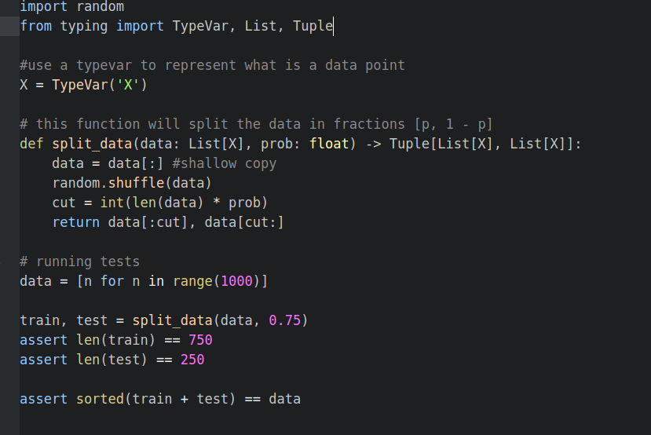
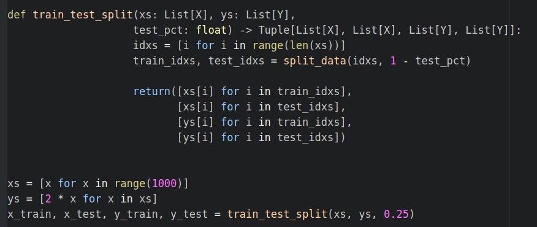

# Machine learning principles

The purpose of this repository is my self practice of machine learning principles, such as over and under-fitting. Exercise from the Book "Data Science from Scratch"

I am a student that is learning, let me know if you find any errors,the code is inspired from examples and exercises found in books.

## What I've learned?

* Machine learning is more than just training super complex models, is mainly about getting to understand your data set and    how can we use this data to solve "real life" problems.

* Even though machine learning is not only about models, models are essential to understand its purpose. Models tries to highlight mathematical or probabilistic relationships between different variables

* Machine Learning is about creating and using models that learned from data

* Overfitting is about creating a model that performs really well on the data used to train, however it can't generalize to new data

* Underfitting is about a model that doesn't perform well even on the training data

* It is also important to measure the precision and recall of the model, therefore we can use the f1_score that combines both. Clearly there is a trade-off between precision and recall, the more precise you are, more likely you are to have a low recall (false negatives), in the other hand, saying yes too often will give a lot of false positives

## The code

* To make sure that our model isn't too complex, we need to use different data to train the model and to test it.
Therefore we will start by splitting the dataset, two-thirds will be used to train, the remaining third to measure the model performance

* The data need to be paired, i.e. the inputs and outputs variables need to correspond to the training and the test set.

Now we could do something like instantiate the model, train it and finally test its performance

Eventually we could split the data in three parts:
1. Training set for building models
2. Validation to choose among the models
3. Test for define the final best model

## Resources that I used to learn about this fun topic:
* Book: Data Science from Scratch, Joel Grus
